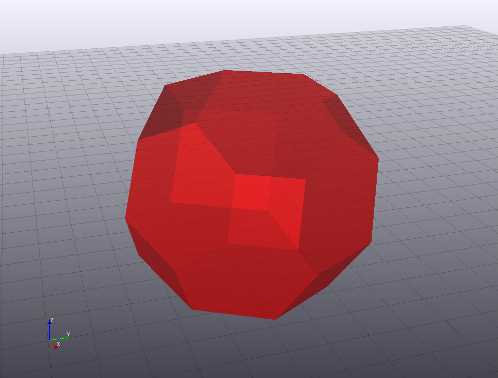
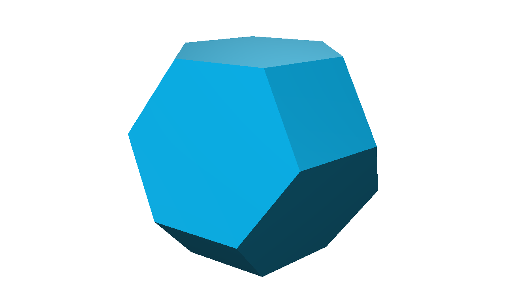

# Polyhedra

Polyhedra provides an unified interface for Polyhedra Manipulation Libraries such as [CDDLib.jl](https://github.com/blegat/CDDLib.jl).
These manipulation notably include the transformation from (resp. to) an inequality representation of a polyhedron to (resp. from) its generator representation (convex hull of points + conic hull of rays) and projection/elimination of a variable with e.g. [Fourier-Motzkin](https://en.wikipedia.org/wiki/Fourier%E2%80%93Motzkin_elimination).

Documentation can be found [here](http://polyhedra.readthedocs.org/).

It defines the abstract type `Polyhedron` and splits the operations on this type in two categories:

* Mandatory: Operations that needs to be implemented by the Polyhedra Manipulation Libraries: e.g. Transformation between the two representations described above and variable elimination.
* Optional: Operations that can be implemented using the other operations and hence have a default implementation: e.g. creation of the polyhedron from the feasible set of a [JuMP](https://github.com/JuliaOpt/JuMP.jl) model, linear transformation, intersection, [Minkowski addition](https://en.wikipedia.org/wiki/Minkowski_addition), decomposition into points and faces for e.g. 3D visualization using [DrakeVisualizer](https://github.com/rdeits/DrakeVisualizer.jl) or [GLVisualize.jl](https://github.com/JuliaGL/GLVisualize.jl)...

Here is a list of the Polyhedra Manipulation Libraries implementing the interface of `Polyhedra.jl`

* [CDDLib.jl](https://github.com/blegat/CDDLib.jl): fully working, supports doing all the computations in `Float64` or `Rational{BigInt}`.
* [LRSLib.jl](https://github.com/blegat/LRSLib.jl): work in progress, will support doing all the computations in `Rational{BigInt}`.

Please let me know if you plan to write a new wrapper (or an implementation in pure Julia).
Since libraries (`cdd`, `lrs`, `pd`, `porta`, `qhull`, ...) use different algorithms, there is no better library for every problem; [here](http://cgm.cs.mcgill.ca/~avis/doc/avis/ABS96a.ps) is a comparison.
