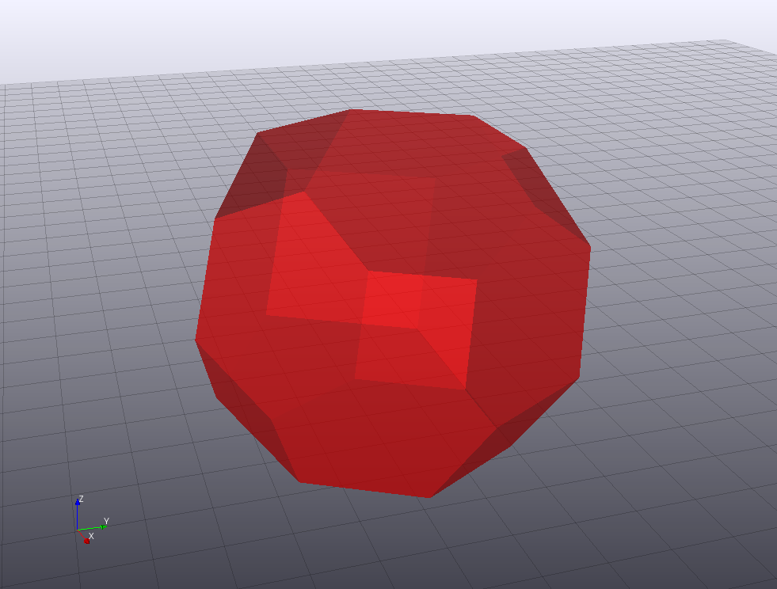
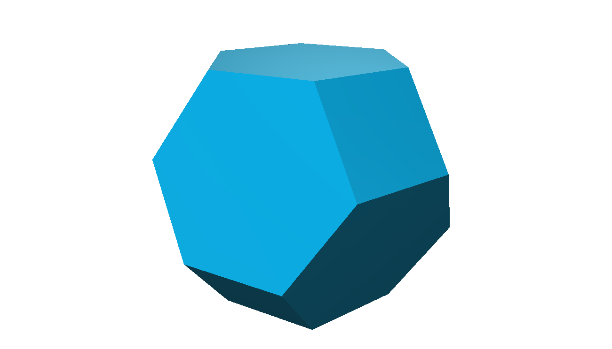

# Polyhedra

| **Documentation** | **Build Status** | **Social** |
|:-----------------:|:----------------:|:----------:|
| [![][docs-stable-img]][docs-stable-url] | [![Build Status][build-img]][build-url] | [[][slack-url] |
| [![][docs-latest-img]][docs-latest-url] | [![Codecov branch][codecov-img]][codecov-url] | [][discourse-url] |

Polyhedra provides an unified interface for Polyhedral Computation Libraries such as [CDDLib.jl](https://github.com/JuliaPolyhedra/CDDLib.jl).
These manipulation notably include the transformation from (resp. to) an inequality representation of a polyhedron to (resp. from) its generator representation (convex hull of points + conic hull of rays) and projection/elimination of a variable with e.g. [Fourier-Motzkin](https://en.wikipedia.org/wiki/Fourier%E2%80%93Motzkin_elimination).

It defines the abstract type `Polyhedron` and splits the operations on this type in two categories:

* Mandatory: Operations that needs to be implemented by the Polyhedral Computation Libraries: e.g. Transformation between the two representations described above and variable elimination.
* Optional: Operations that can be implemented using the other operations and hence have a default implementation: e.g. creation of the polyhedron from the feasible set of a [JuMP](https://github.com/jump-dev/JuMP.jl) model, linear transformation, intersection, [Minkowski addition](https://en.wikipedia.org/wiki/Minkowski_addition), decomposition into points and faces for e.g. 3D visualization using [MeshCat](https://github.com/rdeits/MeshCat.jl) or [Makie.jl](https://github.com/JuliaPlots/Makie.jl)...

## Documentation

- [**STABLE**][docs-stable-url] &mdash; **most recently tagged version of the documentation.**
- [**LATEST**][docs-latest-url] &mdash; *in-development version of the documentation.*

## Citing

Please cite the [JuliaCon 2023 presentation](https://pretalx.com/juliacon2023/talk/JP3SPX/) [[Slides](https://drive.google.com/file/d/1iSalXEqRO3AjHLm-3TqYLjby267n6uo5/view)].

See [CITATION.bib](https://github.com/JuliaPolyhedra/Polyhedra.jl/blob/master/CITATION.bib) for the BibTeX.

[docs-stable-img]: https://img.shields.io/badge/docs-stable-blue.svg
[docs-latest-img]: https://img.shields.io/badge/docs-latest-blue.svg
[docs-stable-url]: https://juliapolyhedra.github.io/Polyhedra.jl/stable
[docs-latest-url]: https://juliapolyhedra.github.io/Polyhedra.jl/dev

[build-img]: https://github.com/JuliaPolyhedra/Polyhedra.jl/workflows/CI/badge.svg?branch=master
[build-url]: https://github.com/JuliaPolyhedra/Polyhedra.jl/actions?query=workflow%3ACI
[codecov-img]: http://codecov.io/github/JuliaPolyhedra/Polyhedra.jl/coverage.svg?branch=master
[codecov-url]: http://codecov.io/github/JuliaPolyhedra/Polyhedra.jl?branch=master

[slack-url]: https://julialang.slack.com/archives/CGLL6RY8Y
[discourse-url]: https://discourse.julialang.org/c/domain/opt
